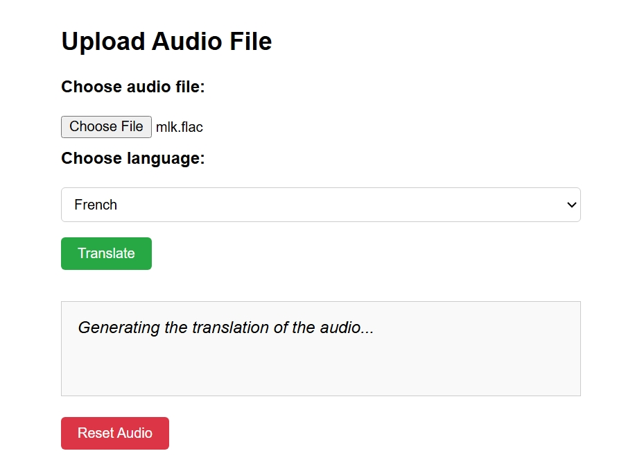

# Audio to Text Translator (Flask + OpenAI Whisper)

This project is a web application that allows users to upload audio file and receive accurate transcriptions using OpenAI's Whisper model. Built with Flask, it provides a simple interface for converting speech in audio files to text, supporting a wide range of audio formats and `multiple languages`.

---

## Features

- **Audio Upload:** Upload audio files in various formats (e.g., WAV, MP3, FLAC).
- **Language Selection:** Choose from 90+ supported languages for transcription.
- **Automatic Speech Recognition:** Uses OpenAI Whisper for high-quality transcription.
- **Audio Playback:** Listen to the uploaded audio directly in the browser.
- **User-Friendly Interface:** Clean, responsive design for ease of use.

---

## Demo





---

## Getting Started

### Prerequisites

- Python 3.8+
- pip (Python package manager)
- [FFmpeg](https://ffmpeg.org/download.html) installed and added to your system PATH (required by Whisper for audio processing)

### Installation

1. **Clone the repository:**
    ```bash
    git clone https://github.com/AbhishekSinghPursuit/audio-to-text-flask-app.git
    cd audio-to-text-flask-app
    ```

2. **Create and activate a virtual environment (optional but recommended):**
    ```bash
    python -m venv venv
    # On Windows:
    venv\Scripts\activate
    # On macOS/Linux:
    source venv/bin/activate
    ```

3. **Install dependencies:**
    ```bash
    pip install -r requirements.txt
    ```

4. **Install FFmpeg:**
    - Download FFmpeg from [ffmpeg.org](https://ffmpeg.org/download.html).
    - Extract and add the `bin` folder to your system PATH.
    - Test installation:
      ```bash
      ffmpeg -version
      ```

---

## Usage

1. **Run the Flask app:**
    ```bash
    python app.py
    ```
    The app will be available at [http://localhost:5001](http://localhost:5001).

2. **Upload an audio file:**
    - Click `Choose audio file` and select your file.
    - Select your `desired language` from the dropdown menu.
    - Click `Translate` to transcribe the audio.
    - The transcription will appear below, and you can play back the audio.

---

## Language Support

The app supports transcription in 90+ languages. Simply select your preferred language from the dropdown before uploading your audio file.  
Some supported languages include: English, Hindi, Spanish, French, German, Chinese, Russian, Japanese, Arabic, and many more.

---

## Project Structure

```
audio-to-text-translator/
│
├── app.py
├── requirements.txt
├── static/
│   └── uploads/
├── templates/
│   └── home.html
│   └── about.html
└── README.md
```

---

## How It Works

- The user uploads an audio file via the web interface.
- The user selects the language for transcription.
- The file is saved to the `static/uploads` directory.
- The Whisper model (`turbo` by default) processes the audio and generates a transcription in the selected language.
- The transcription is displayed on the page, and the audio can be played back.

---

## Customization

- **Change Whisper Model:**  
  In `app.py`, modify:
  ```python
  model = whisper.load_model("turbo")
  ```
  to use `"tiny"`, `"base"`, `"small"`, `"medium"`, or `"large"` as needed.

- **Supported Audio Formats:**  
  The app accepts any format supported by FFmpeg (WAV, MP3, FLAC, etc.).

---

## Troubleshooting

- **FFmpeg Not Found:**  
  If you see errors like `[WinError 2] The system cannot find the file specified`, ensure FFmpeg is installed and its `bin` directory is in your system PATH.

- **Model Download Slow:**  
  The first run will download the Whisper model. This may take a few minutes depending on your internet speed.

- **Performance:**  
  Transcription speed depends on your hardware and the model size. For faster results, use the `"tiny"` or `"base"` models.

---

## Acknowledgements

- [OpenAI Whisper](https://github.com/openai/whisper)
- [Flask](https://flask.palletsprojects.com/)
- [FFmpeg](https://ffmpeg.org/)

---

## Contributing
* Fork the repository.
* Create a new branch (`git checkout -b feature-branch`).
* Make your changes.
* Commit your changes (`git commit -m 'Add some feature`).
* Push to the branch (`git push origin feature-branch`).
* Open a pull request.

## License
This project is licensed under the MIT License - see the [LICENSE](LICENSE) file for details.

## Contact Me
For any inquiries or support, please reach out to:

* **Author:** [Abhishek Singh](https://github.com/SinghIsWriting/)
* **LinkedIn:** [My LinkedIn Profile](https://www.linkedin.com/in/abhishek-singh-bba2662a9)
* **Portfolio:** [Abhishek Singh Portfolio](https://portfolio-abhishek-singh-nine.vercel.app/)
